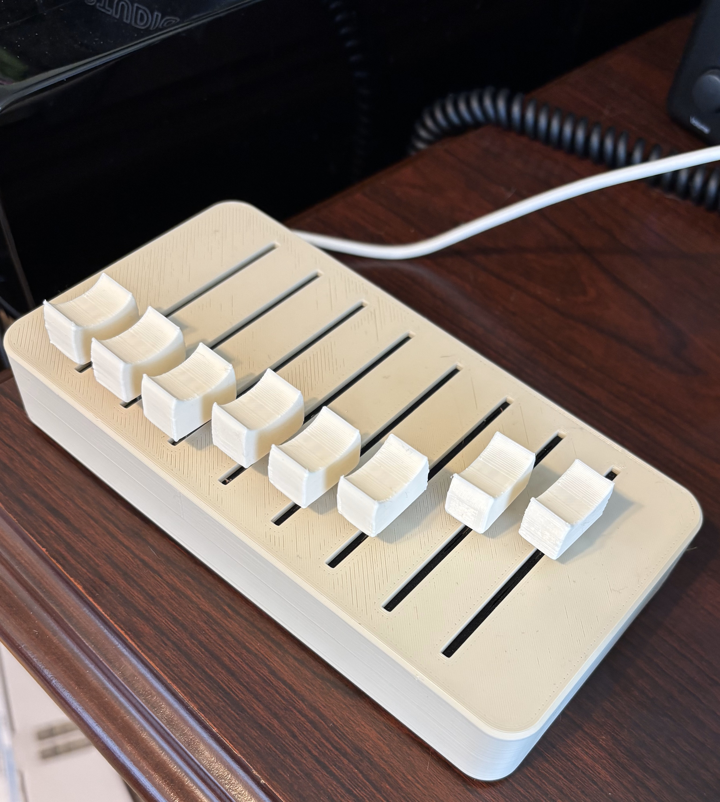
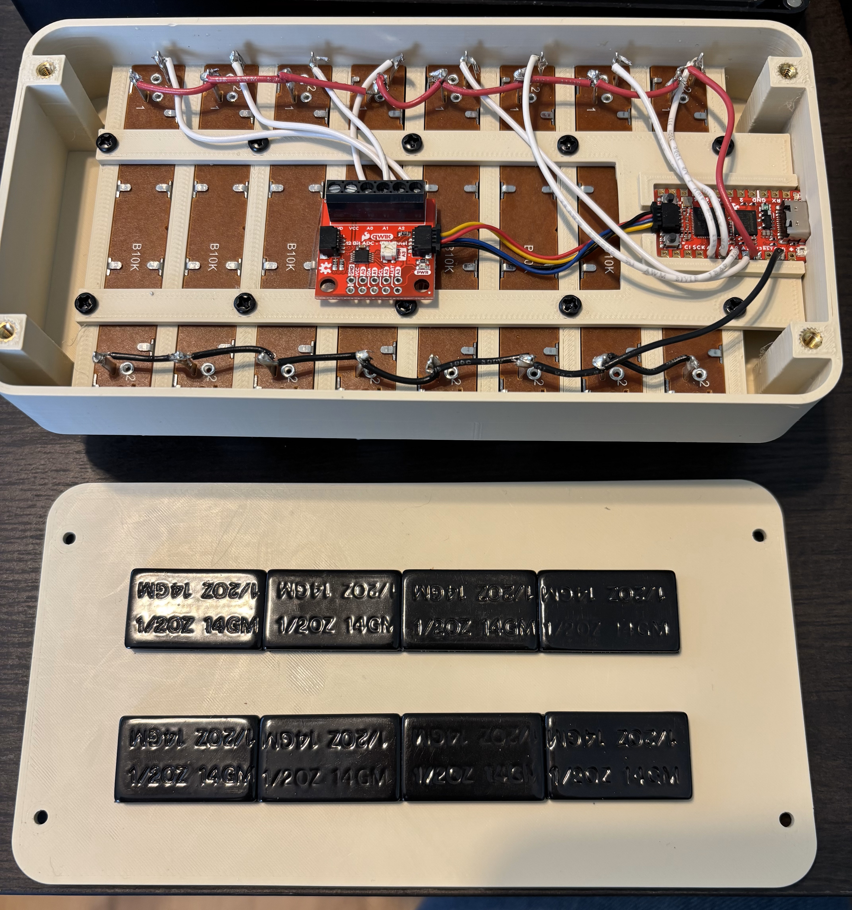

# MidiSliders - DIY 8-fader bank

I wanted a small MIDI controller with a few faders on it. But most of the ones
you find online are way too expensive! So I made this instead.

## Bill of Materials

These are the electronics parts I used. In retrospect, an analog mux would have
been cheaper than the ADS* device. But SparkFun was out of stock on those.

 - [Slide Pot - X-Large (qty: 8)](https://www.sparkfun.com/products/9119)
 - [SparkFun Qwiic 12 Bit ADC - 4 Channel ADS1015 (qty: 1)](https://www.sparkfun.com/products/15334)
 - [SparkFun Pro Micro - RP2040 (qty: 1)](https://www.sparkfun.com/products/18288)
 - [Flexible Qwiic Cable - 50mm (qty: 1)](https://www.sparkfun.com/products/17260)

Other parts I used, that I already had laying around:

 - M3 x 8mm self tapping plastic screws (qty: 10)
 - M3 x 8mm pan head machine screws (qty: 4)
 - M3 heat-set insert (qty: 4)
 - Wheel weights (qty: 8)
 - Rubber feet (qty: 4)

The wheel weights are optional. They just help keep the whole body from tilting
when you're at the top or bottom of the travel for a slider.

As an alternative to the M3 heat-set inserts, you could also probably use some
M4 size self-tapping plastic screws. I preferred the inserts for attaching the
bottom just because I anticipated needing to take the bottom lid off a few
times.

Overall this build cost about $50 in new parts.

## Assembly

All the relevant print and design files are in the `3dPrint` folder. When
printing the main body, you will need some very small supports on the side where
the microcontroller sticks out. Use a hobby knife to cut them out and make room
for the board.

During assembly, chain all of the 1 pins of the sliders together, as well as all
of the 2 pins. The signal is on the 3 pin.

Be sure to slice the jumper on the ADS board that connects the trim pot to A3,
or your last slider will probably behave weird.

Use hot glue or double-sided tape under the ADS board to ensure it doesn't short
out with the tabs on the back of the sliders.

## Firmware

Pre-compiled firmware is included, just flash the UF2 file. If you want to
change the CC mappings though or if you e.g. want to swap to an analog mux, you
will need to recompile. Use PlatformIO to build the firmware.
